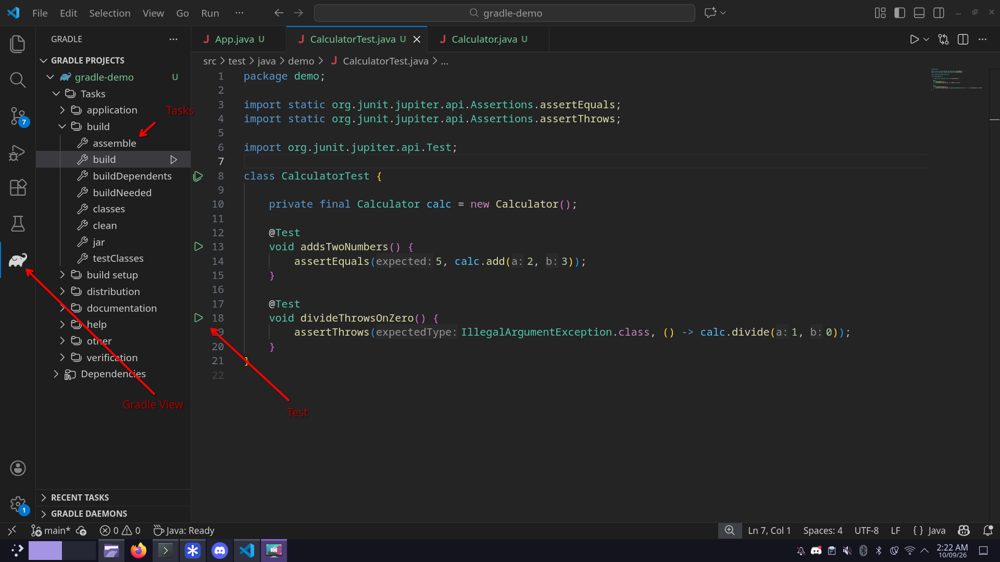
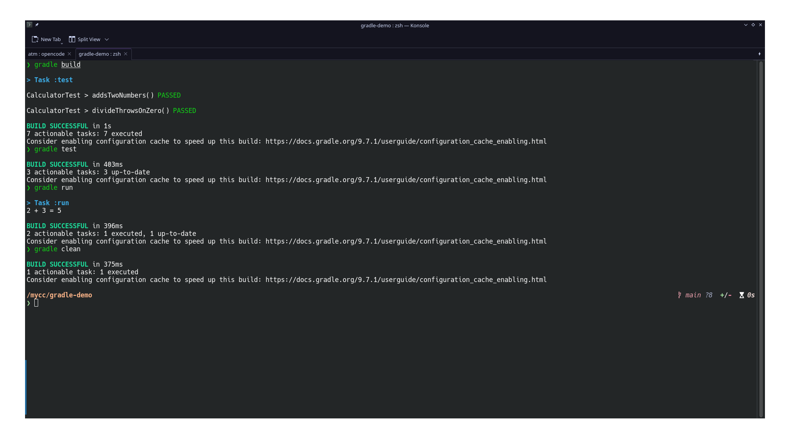

# Gradle Demo, Step by Step

This is a small standalone repo you can use to show how a Gradle Java project
works in VS Code.

```
gradle-demo/
  settings.gradle                        -> rootProject.name = 'gradle-demo'
  build.gradle                           -> plugins: java + application, JUnit 5
  src/main/java/demo/Calculator.java
  src/main/java/demo/App.java             -> main(), prints 2 + 3
  src/test/java/demo/CalculatorTest.java  -> 2 JUnit tests
```

A quick note on tasks: `build`, `test`, `clean`, `run` and `check` are already
there. They come with the `java` and `application` plugins in `build.gradle`,
so nobody has to create them. We only tweak them a little (for example,
`test { useJUnitPlatform() }` tells the test task to use JUnit 5). You can see
the full list anytime with `gradle tasks --all`.

---

## 0. What we need

1. Java 21 (`openjdk-21-jdk`)
2. Gradle 9.x (tested with 9.7.1)
3. VS Code (latest stable) with 2 extensions:
   - `vscjava.vscode-java-pack` (Microsoft Extension Pack for Java, which
     already contains the Red Hat language support, the debugger and the
     test runner)
   - `vscjava.vscode-gradle` (the Gradle tasks panel)

Please do not use Code Runner here. It compiles single files directly and
skips `build.gradle` and JUnit, so it will only cause confusion.

---

## 1. Lab setup (for the lab team)

Please set up a fresh user account that has exactly the tools listed above:

1. Java 21
2. Gradle 9.x
3. VS Code with only these two extensions:
   - Microsoft Extension Pack for Java (Red Hat language support is included)
   - Gradle for Java

No other extensions (especially no Code Runner). Starting from a fresh account
makes sure old extensions and settings cannot paint false errors over code
that is actually fine.

---

## PART A: The GUI way (clicking around in VS Code)

### A0. Install the two extensions (skip this if they are already there)

```bash
code --install-extension vscjava.vscode-java-pack
code --install-extension vscjava.vscode-gradle
```

### A1. Get the project and open it

1. Clone it (in a terminal):
   ```bash
   git clone https://github.com/vajradevam/gradle-demo.git
   ```
2. Then in VS Code: `File > Open Folder > gradle-demo/`.
3. If VS Code asks to import the Gradle project, say yes. Then give the
   language server a moment to finish (the status bar will settle down).
4. If it never asks: press `Ctrl+Shift+P` and run
   `Gradle: Refresh Gradle Projects` or `Java: Reload Projects`.

### A2. Where to find things

| What you want | Where it is | What to expect |
|------|------|------|
| Build/test/clean/run tasks | Far-left Activity Bar, the elephant `Gradle` icon, then `GRADLE PROJECTS > gradle-demo > Tasks` | `build > build`, `verification > test`, `build > clean`, `application > run`. Hover a task and press `▶ Run Task` (double-clicking works too). The output shows up in the `TERMINAL > Gradle Tasks` panel. |
| Same tasks, with the keyboard | `Ctrl+Shift+P > Gradle: Run Gradle Task > gradle-demo > <task>` | For example `test`, `build`, `run`, `clean`. |
| Run one test or all of them | Open `CalculatorTest.java` | Look for the green `▶ Run Test` links above the class and above each `@Test` method. |
| Run all tests in a nice view | Far-left Activity Bar, the `Testing` view (beaker icon) | A `Run Tests` button at the top, green and red marks per test, and the stack trace when you click a failure. |
| Run the app | Open `App.java` (it has a `main()`) | A `▶ Run Java` / `Debug` button at the top right. `Calculator.java` has no such button, which is normal because it has no `main()`. |



### A3. Try these in order

1. In the Gradle view, run `Tasks > build > build`. You should see `BUILD SUCCESSFUL`.
2. Open `CalculatorTest.java` and press `Run Test`. Both tests should pass in the Testing view.
3. In the Gradle view, run `Tasks > application > run`. You should see `2 + 3 = 5`.
4. In the Gradle view, run `Tasks > build > clean`. The `build/` folder goes away.

If something fails, start with the `Gradle Tasks` output and the `PROBLEMS`
tab. A failing test also shows up in the Testing view with the assertion
diff, which is usually the fastest way to see what went wrong.

---

## PART B: The terminal way

A small ground rule for this part: everything happens in the terminal. VS Code
itself is opened from the terminal with `code .`, so there is no need for
`File > Open` here.

### B1. Clone and open

```bash
git clone https://github.com/vajradevam/gradle-demo.git
cd gradle-demo

code .   # opens this folder in VS Code, which then imports the Gradle project
```

In VS Code, accept the `Java: Import Gradle Project` prompt once. From there
you can either click the Part A buttons or just stay in the terminal and carry
on below.

### B2. Build, test, run and clean from the terminal

`gradle` (or `gradlew`) only works inside the project root, and you are
already in `gradle-demo/` from step B1, so just run:

```bash
gradle build   # compiles everything, runs the tests, builds the jar
gradle test    # runs only the JUnit tests, one PASSED/FAILED line each
gradle run     # runs the app (demo.App), prints "2 + 3 = 5"
gradle clean   # deletes build/

# handy extras
gradle tasks --all        # shows the tasks the plugins created for you
gradle test --rerun-tasks # runs the tests again even if nothing changed
gradle test --info        # extra detail when you are hunting a failure
```

It should look something like this.
